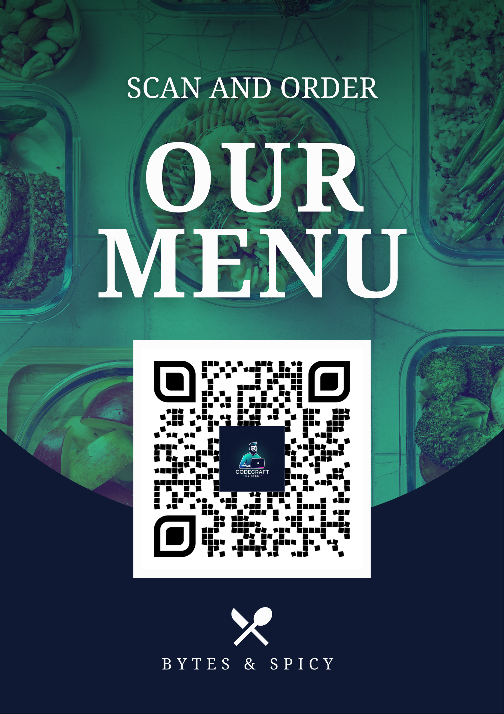

# 🚀 Bytes & Spicy — Digital QR Menu

Modern · Mobile-First · Lightning Fast

A clean, café-ready QR menu experience built with HTML, Tailwind CSS, and JavaScript — designed to replace outdated paper menus with something fresh, hygienic, and aesthetic.

---

📌 Badges

<!-- Add CI, demo or license badges here -->


🌟 Story — How This Idea Started

I visited a café for snacks one evening, picked up the menu, and instantly noticed… it was dead — colors faded, lamination peeling, totally unhygienic.

Right there my brain went:

“Menus should be digital. Why not build a QR-based experience?”

So I built this:

Scan → Clean menu opens instantly

- No app
- No backend
- Works on any phone
- Fast, aesthetic, practical

A small café moment turned into a polished project that restaurants can actually use.

---

🔥 Features

- 📱 Mobile-first UI
- 🎥 Video hero section with gradient overlay
- 🍽 Categorized menus (All / Starters / Main / Drinks / Desserts)
- ⚡ Lazy-loaded images for performance
- 🎯 Smooth category filtering
- 🧊 Glassmorphism effects & soft shadows
- 🖱 Animated cards & transitions
- 🖨 QR-ready (print or display)
- 🌐 Pure frontend — no backend required

---

🔗 Live Demo & Portfolio

- Live Demo: (https://qr-menu-card.netlify.app/)
- Developer Portfolio: https://codecraftbysyed-portfolio.vercel.app/

---
---
Digital QR Menu Design 

---
Normal QR Menu Design 

---

(Add your own screenshots here later — UI, hero section, menu categories, mobile view)

1. Hero Section Preview
2. Menu Cards Preview
3. Mobile Navigation Preview
4. QR Scan Preview (Optional)

📱 QR Code (Add Yours Here)

👉 Place your QR PNG here:


```html
<div class="qr-card">
  
  <p>Scan to open the menu</p>
</div>
```

Generate QR with:

- https://www.qrserver.com
- https://www.qrcode-monkey.com

---

🛠 Tech Stack

- HTML5 (structure)
- Tailwind CSS (layout & responsive design)
- Custom CSS (effects, animations, theme)
- JavaScript (category logic, scroll behavior)

---

📁 Project Structure

```
Bytes-And-Spicy/
 ├── index.html
 ├── js/
 │    └── script.js
 ├── src/
 │    └── style.css
 ├── images/
 │    └── menu-item-images...
 ├── video/
 │    └── hero-video.webm
 └── qr.png (your QR goes here)
```

---

✏️ How to Customize

- 🏪 Restaurant Name

  Edit inside `.hero-content` in `index.html`.

- 🎥 Hero Background

  Replace hero video inside `/video/`.

- 🍔 Menu Items

  Edit `menu.json` (if present) or update the generator in `js/script.js`.

- 📞 Footer Details

  Update contact text at the bottom of the page.

---

⭐ Upgrades You Can Add

If you want, I can also implement:

- ✔ Inline QR preview inside the website
- ✔ Printable table card design (modern + minimal)
- ✔ Favorites system using localStorage
- ✔ Dynamic JSON-powered menu
- ✔ Admin panel for restaurant owners
- ✔ Category animations + micro-interactions

Just tell me what vibe you want.

---

📄 License

This project is released under the MIT License.
Created with ❤️ by CodeCraft by Syed.


